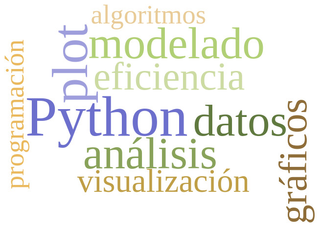

#Acerca de este curso

Este curso te proporcionará las bases del lenguaje de programación en python para el manejo y la administración de datos biomédicos. Es uno de los lenguajes de programación más utilizados para la estadística y la ciencia de datos. El presente curso contiene los contenidos esenciales como para poder manipular secuencias y archivos. 

Es un curso de programación en Python que prepara a los estudiantes
para poder **programar algoritmos** y comprender los métodos
desarrollados por otros en el ámbito de la ingeniería biomédica. Está orientado a preparar a los estudiantes para
profundizar en temas de **análisis y visualización de datos, aprendizaje automático, modelado matemático y desarrollo de scripts**.

Se suponen los conocimientos previos de Introducción a la programación I. 

## Contenidos
El objetivo de este curso es enseñar los fundamentos del lenguaje
Python y algunos conceptos del diseño de algoritmos. El curso está orientado al manejo de datos, a la escritura de scripts y a una organización adecuada de los programas. Estudiaremos un poco de teoría de algoritmos, incluyendo conceptos básicos de la teoría de la complejidad y algunas estructuras de datos no triviales. Introduciremos la programación orientada a objetos. Al final de este curso les estudiantes deberían poder escribir sus propios programas en Python así como entender y modificar programas escritos por otres.

## Requerimientos
Para hacer este curso solo hace falta tener instalado el Python 3.6
(o uno más nuevo). Pedimos tener alguna experiencia previa programando,
aunque sea poca. Este no es un curso de introducción a la informática/programación.

## Contenidos

Te sugerimos leer y probar las clases en el siguiente orden: 

* [1. Tipos y estructuras de datos](/clases/TiposDatos.md)
* [2. Qué es un script?](/clases/Scripts.md)
* [3. Estilos de codeo](/clases/Estilo.md)
* [4. Módulos](/clases/Modulos.md)
* [5. Secuencias](/clases/Secuencias.md)
* [6. Trabajar con datos numéricos: biblioteca numpy](/clases/NumPy_Arrays.md)
* [7. Funciones](/clases/Funciones.md)
* [8. Introducción a la recursión](/clases/Recursion.md)
* [9. Contenedores](/clases/Contenedores.md)
* [10. Contadores del módulo collections](/clases/Contadores.md)
* [11. Introducción a la POO](/clases/Clases.md)
* [12. Objetos](/clases/Objetos.md)
* [13. Métodos especiales](/clases/Métodos_Especiales.md)
* [14. Archivos](/clases/Archivos.md)
* [15. Archivos y carpetas](/clases/Archivos_y_Directorios.md)
* [16. Gráficos con la biblioteca matplotlib](/clases/Matplotlib.md)
    
